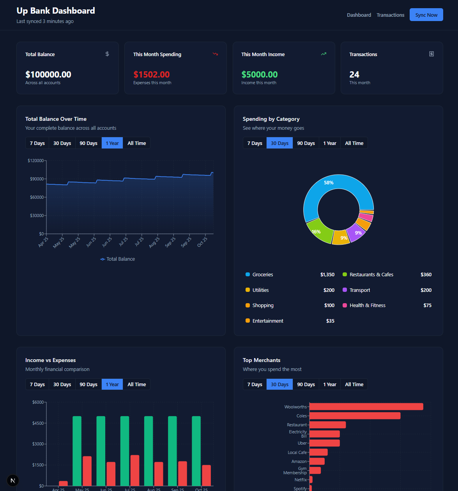

# Up Bank Webapp

A simple web application for viewing and analysing Up Bank transactions via the available [API](https://github.com/up-banking/api). Build for simple local deployment with Next.js and SQLite.

## Example Screenshot (simulated data)


## Features

- **Interactive Analytics** - Several charts for visualising spending / saving patterns
- **Transaction Review** - Search and filter transactions
- **Data Storage** - Stored locally in SQLite or exportable to CSV
- **Smart Sync** - Initial full sync, then incremental updates only

## Quick Start

To use this app you will need to grab a personal access token for your account from [api.up.com.au](https://api.up.com.au).

### Installation

1. **Clone the repository**
   ```bash
   git clone https://github.com/TomTonroe/up-bank-webapp.git
   cd up-bank-webapp
   ```

2. **Install dependencies**
   ```bash
   npm install
   ```

3. **Configure your [API token](https://api.up.com.au)**
   ```bash
   # Copy the example environment file
   cp .env.example .env.local

   # Edit .env.local and add your API token
   # UP_BANK_API_TOKEN=up:yeah:your_token_here
   ```

4. **Start the development server**
   ```bash
   npm run dev
   ```

5. **Open your browser**
   - Navigate to [http://localhost:3000](http://localhost:3000)
   - Click "Run Initial Sync" to download your data
   - Wait for initial sync (may take some time)
   - Start exploring your data!

## Analytics Features

- **Balance Timeline** - Income and expenses over time
- **Category Breakdown** - Pie chart of spending by category
- **Income vs Expenses** - Monthly comparison chart
- **Top Merchants** - Bar chart of highest spending
- **Account Distribution** - Treemap of account balances
- **Transaction Velocity** - Frequency and volume trends
- **Category Trends** - Spending patterns over time

## Development

### Commands

```bash
npm run dev    # Start development server
npm run build  # Build for production
npm start      # Start production server
npm run lint   # Lint code
npm run reset  # Clear database and cache
```

### Reset Database

To start fresh:

```bash
npm run reset
npm run dev
```

This will delete the SQLite database and Next.js cache, allowing you to re-sync from Up Bank.

### Security Note

**This is designed for experimentation on local or secure home networks only.**

- **Only use on** your personal computer or secure home network
- Your API token is stored in `.env.local` - keep this file secure
- Transaction data is stored in a local SQLite database without encryption